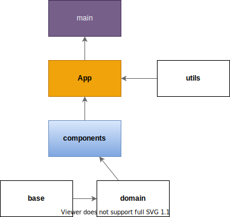

# 25 Beginner JavaScript Project ideas

### SPA(branch-[develop](https://github.com/jinhwansuh/25-Beginner-JavaScript-Project-ideas/tree/develop))  Deploy : https://25-beginner-java-script-project-ideas.vercel.app/

### Static(branch-[develop-feature](https://github.com/jinhwansuh/25-Beginner-JavaScript-Project-ideas/tree/develop-feature)) Deploy : https://jinhwansuh.github.io/25-Beginner-JavaScript-Project-ideas/

--- 
https://dev.to/codefoxx/25-beginner-javascript-project-ideas-3m9h

위 25개의 프로젝트를 **Vanilla JS**로, **React의 컴포넌트 방식**과 [Atomic Design](https://kciter.so/posts/effective-atomic-design )을 최대한 이용하여 구현합니다.

각 프로젝트의 폴더구조는 각 [프로젝트 Wiki](https://github.com/jinhwansuh/25-Beginner-JavaScript-Project-ideas/wiki)를 통해 확인할 수 있습니다.

## Structure

> main : html파일을 연결하는 통로
> 
> App : 모든 기능을 수행하는 로직이 들어있고 화면에 보여줄 컴포넌트들을 불러오는 파일
> 
> components - base : 화면을 구성하는 최소단위의 파일들 Atom.
> 
> components - domain : 최소단위의 파일들을 병합하는 파일들 Molecule or Organism
